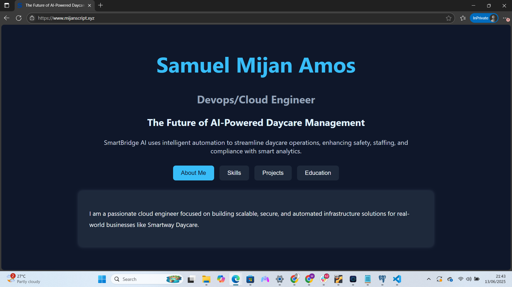

# Altschool_exam_project

# Node.js Website Deployment on Ubuntu EC2 with Nginx, Domain, and SSL

This README outlines the steps to deploy a Node.js website on an Ubuntu EC2 instance using Nginx as a reverse proxy, along with domain setup and SSL certification using Certbot.

##  Landing Page

---

##  Prerequisites

- An AWS account with access to create EC2 instances and Elastic IPs
- A registered domain name (e.g., from Namecheap, GoDaddy, etc.)
- GitHub repository containing your Node.js website
- Basic knowledge of the Linux terminal

---

##  1. Launch EC2 Instance

- Launch an Ubuntu Server EC2 instance (e.g., Ubuntu 22.04 LTS)
- Choose a security group that allows inbound traffic:
  - HTTP (Port 80)
  - HTTPS (Port 443)
  - SSH (Port 22)

---

##  2. Connect and Setup Server

```bash
ssh -i /path/to/my-key.pem ubuntu@your-ec2-public-ip
```

### Update and Upgrade the Server

```bash
sudo apt update && sudo apt upgrade -y
```

---

##  3. Cloned My Node.js App

```bash
cd ~
git clone https://github.com/Mijanscripts/Altschool_exam_project.git
cd my-nodejs-repo
```

> Make sure my app listens on `localhost:5050` or update my code to do so.

---

##  4. Create a systemd Service for Node.js

Create a service file:

```bash
sudo nano /etc/systemd/system/myapp.service
```

Add the following:

```ini
[Unit]
Description=Node.js Application
After=network.target

[Service]
ExecStart=/usr/bin/node /home/ubuntu/Altschool_exam_project/myapp.js
Restart=always
User=ubuntu
Environment=PORT=5050
WorkingDirectory=/home/ubuntu/Altschool_exam_project

[Install]
WantedBy=multi-user.target
```

> Replace `/myapp.js` with my actual entry file.

### Reload, Enable, and Start the Service

```bash
sudo systemctl daemon-reexec
sudo systemctl daemon-reload
sudo systemctl enable myapp.service
sudo systemctl start myapp.service
```

### Check the status

```bash
sudo systemctl status myapp.service
```

---

##  5. Install and Configure Nginx

```bash
sudo apt install nginx -y
```

### Configure Nginx as a Reverse Proxy

Edit the default site config:

```bash
sudo nano /etc/nginx/sites-available/default
```

Replace the contents with:

```nginx
server {
    listen 80;
    server_name mijanscript.xyz www.mijanscript.xyz;

    location / {
        proxy_pass http://localhost:5050;
        proxy_http_version 1.1;
        proxy_set_header Upgrade $http_upgrade;
        proxy_set_header Connection 'upgrade';
        proxy_set_header Host $host;
        proxy_cache_bypass $http_upgrade;
    }
}
```

### Restart Nginx

```bash
sudo systemctl restart nginx
```

---

##  6. Allocate and Associate Elastic IP

- In AWS EC2 Dashboard:
  - Go to **Elastic IPs**
  - Allocate a new Elastic IP
  - Associate it with my EC2 instance public ip address

Update my domain's DNS **A record** to point to this Elastic IP.

---

##  7. Open Inbound Ports in Security Group

Edit my EC2 instance's security group to allow:

- **Port 80 (HTTP)**
- **Port 443 (HTTPS)**

---

##  8. Install Certbot and Enable HTTPS

```bash
sudo apt install certbot python3-certbot-nginx -y
```

Run Certbot to automatically configure SSL:

```bash
sudo certbot --nginx -d mijanscript.xyz -d www.mijanscript.xyz
```

Follow the prompts to allow HTTPS access and redirect HTTP to HTTPS.

---

##  9. Verify Everything Works

- Visit `http://mijanscript.xyz` → should redirect to `https://mijanscript.xyz`
- `systemctl status myapp.service` → should be `active (running)`
- `sudo nginx -t` → should return syntax OK

---

##  Optional: Restart Services

If you change configs later, restart both services:

```bash
sudo systemctl restart myapp.service
sudo systemctl restart nginx
```

---

##  Summary

| Component       | Purpose                                  |
|----------------|-------------------------------------------|
| EC2 Instance    | Host the server                          |
| systemd         | Keep Node.js running in background       |
| Nginx           | Reverse proxy, serve domain, SSL         |
| Certbot         | SSL certificate for HTTPS                |
| Elastic IP      | Static IP for reliable DNS pointing      |
| Domain Name     | Public access via readable address       |

---

##  Troubleshooting

- Check Nginx logs: `sudo journalctl -u nginx` or `sudo tail -f /var/log/nginx/error.log`
- Check Node.js app logs: `sudo journalctl -u myapp`
- Re-run `certbot` if SSL fails or renews

---

##  Done!

My Node.js app is now running securely on a custom domain (mijanscript.xyz) using HTTPS with auto-restart and reverse proxy configured.
